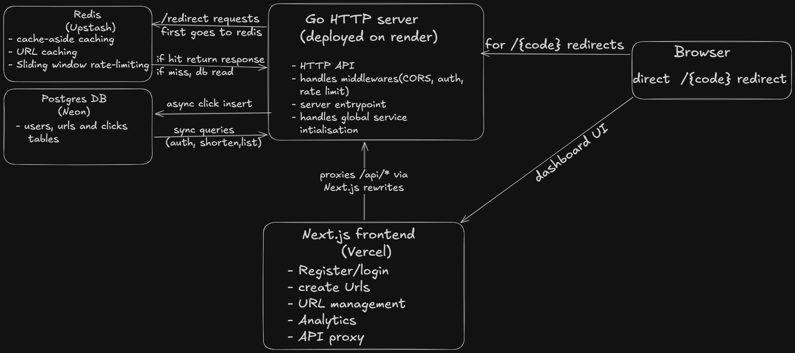

# Snip

A production-grade URL shortener written in Go.

**Live demo:** https://snip-peach.vercel.app ·
**API:** https://snip-seo2.onrender.com

Short codes are generated with cryptographic randomness, redirects are cached in Redis,
and every click is recorded asynchronously into a separate analytics path so the hot
path stays under 10 ms at 5k RPS on a single Render free-tier instance.

---

## Features

- **Custom aliases** — pick your own short code or
  let the server mint a random 6-char Base62 code with collision retry.
- **Click analytics** — every redirect is recorded asynchronously: timestamp, IP,
  user-agent, referrer. Per-link dashboard with a daily timeseries chart,
  top-referrer ranking, and browser breakdown.
- **JWT auth** — stateless HS256 tokens, bcrypt password hashes, email login.
- **Redis cache-aside** on redirects with 24h TTL; falls through to Postgres on miss
  and back-fills.
- **Sliding-window rate limiter** in Redis, separately scoped per route and per
  user/IP. Per-route limiters are configured at boot.
- **Separate connection pooling** — main app traffic and click-write traffic are
  separated so a burst of clicks can't starve user-facing queries.
- **Graceful shutdown** with `signal.NotifyContext` and a server `Shutdown` deadline.
- **Structured `slog` logging** on every request (method, path, status, duration, IP).
- **CORS middleware** with an allowlist (`*` in dev, explicit origins in prod).
- **Dockerized** — multi-stage build, distroless-style alpine final image,
  `docker compose up` for the full stack.

---

## Architecture


  


## Stack

| Layer       | Tool                          |
|-------------|-------------------------------|
| API         | Go 1.26 (`net/http` only)     |
| Database    | PostgreSQL 18 (Neon)          |
| Cache / RL  | Redis (Upstash, TLS)          |
| Frontend    | Next.js 16 (App Router) + TS  |
| Auth        | `golang-jwt/jwt/v5`, bcrypt   |
| Container   | Docker (multi-stage)          |
| Hosting     | Render (API) + Vercel (web)   |

---

## API

| Method   | Path                            | Auth   | Notes                                                  |
|----------|---------------------------------|--------|--------------------------------------------------------|
| `POST`   | `/register`                     | —      | Returns JWT                                            |
| `POST`   | `/login`                        | —      | Email + password, returns JWT                          |
| `POST`   | `/shorten`                      | Bearer | Body: `{ url, alias? }`                                |
| `GET`    | `/{code}`                       | —      | 302 redirect; async click insert                       |
| `DELETE` | `/{code}`                       | Bearer | Owner only                                             |
| `GET`    | `/my-urls`                      | Bearer | Lists caller's links with click counts                 |
| `GET`    | `/stats/{code}`                 | —      | Summary: total clicks, destination, created_at         |
| `GET`    | `/stats/{code}/analytics?days=N`| —      | Timeseries + top referrers + browser breakdown (1–90d) |
| `GET`    | `/health`                       | —      | DB + Redis ping                                        |

---

## Design decisions

**Async, dual-pool click recording.** Redirects are the hottest path. The handler
serves the 302 immediately and spawns a goroutine that writes the click via a
separate `*sql.DB` pool (`clickConn`). A surge of redirects can saturate the
analytics pool without starving login / shorten / dashboard queries on the main pool.

**Cache-aside, not write-through.** Postgres is the source of truth. Redis is
populated lazily on the first miss for a code and TTL'd at 24h. If Redis is down
the limiter and cache **fail open** — the redirect still works, just without
optimization.

**Sliding-window rate limiter in a single round trip.** A Redis pipeline does:
`ZREMRANGEBYSCORE` (drop old entries) → `ZCARD` (count) → `ZADD` (record this
request) → `EXPIRE`. One RTT per check, no Lua script.

**Stateless JWTs.** No session table, no per-request DB lookup. The token carries
`user_id` + `email` + `exp` (24h). The signing key is read from `JWT_SECRET` at
boot. Trade-off: revocation is harder — accepted for a portfolio project.

**Typed context keys.** `userIDKey` is a named `contextKey` type, not a bare
string. Go's `context.Value` matches on type *and* value, so this prevents
silent collisions with other middleware that uses string keys.

**Custom alias validation in two layers.** Application-level checks length /
charset / a reserved-route set; database-level `UNIQUE` constraint on
`short_code` is the final word. On collision the handler returns `409 Conflict`
without retrying.

**No web framework.** `net/http` with the 1.22+ pattern router (`GET /{code}`)
covers everything cleanly. Middleware is plain `http.Handler` composition.

---

## Why Docker


**1. Reproducible production image.** The `Dockerfile` is a multi-stage build —
a `golang:1.26-alpine` stage compiles a static binary, then a tiny `alpine`
final stage runs it. The shipped image is ~20 MB and has no Go toolchain or
build cruft in it. Render pulls this same image.

**2. Zero-install local dependencies.** Postgres and Redis run as compose
services with persistent volumes. `docker compose up -d postgres redis`
gives a clean DB on demand; `docker compose down -v` wipes it.

**3. Hermetic test runner.** A `tests` service (gated behind a compose
profile so it doesn't auto-start) mounts the source into a `golang:1.26-alpine`
container with cached `GOMODCACHE` and build-cache volumes. `docker compose
run --rm tests` runs the unit suite identically to how CI would.

```bash
docker compose run --rm tests                       # full suite
docker compose run --rm tests go test -run X .      # one test
```

---

### Database migrations

Schema lives in `schema.sql` (for fresh installs) and `migrations/*.sql`
(for incremental applies). Apply migrations to an existing database with:

```bash
psql $env:DATABASE_URL -f migrations/001_alias_and_referrer.sql
```

---

## Testing

```bash
go test -v -cover .                              # unit tests, ~78% coverage
docker compose run --rm tests                    # same, inside docker
go test -v ./tests/integration/...               # integration tests (need live API on :3000)
```

Unit tests use `go-sqlmock` for Postgres and `miniredis` for Redis, so they're
hermetic and fast (~2s for the whole suite).

---

## Benchmarks

### Redirect throughput (local, without rate limiter)

```bash
hey -n 5000 -c 50 -disable-redirects http://localhost:3000/MRUM5V
```

```
Requests/sec:  5422
Latency:       avg 9.1 ms · p50 7.0 ms · p95 23 ms · p99 56 ms
Status codes:  302 × 5000
```

The hot path is one Redis `GET` + a goroutine-dispatched click insert. The
Postgres query only fires on cache miss.

### Rate limiter under load (deployed Render instance)

Same command against the production URL. The IP rate limiter on `/{code}`
kicks in almost immediately and starts returning `429 Too Many Requests`:

```bash
hey -n 5000 -c 50 -disable-redirects https://snip-seo2.onrender.com/3VFYDW
```

```
Requests/sec:        187
Latency (success):   avg 254 ms · p50 215 ms · p95 342 ms · p99 903 ms
Status codes:        302 × 132 (allowed)
                     429 × 4868 (rate-limited)
```

This is the rate limiter *working as designed*: 132 redirects landed inside the
window, the remaining 4,868 were rejected with `429` + `Retry-After`. The
~250 ms p50 is dominated by the cross-region round-trip to Render and the cold
Render free-tier instance, not by the server itself.

---

## What I'd build next

- **Background sweeper for expired links.** Add `expires_at` to `urls`, honor it
  on redirect, and run a `time.Ticker` goroutine that prunes expired rows every
  5 min. Lets me talk about goroutine lifecycle and graceful shutdown of
  background work.
- **Prometheus `/metrics` endpoint** with request count, latency histogram, and
  cache hit/miss counters. Wire into a small Grafana panel.
- **OpenAPI spec** served alongside Swagger UI for live API exploration.
- **GeoIP enrichment** on the analytics view (country / city) from a MaxMind
  dump loaded once at boot.

---

## Repo layout

```
.
├── main.go              # routes, handlers (shorten, redirect, stats, analytics)
├── auth.go              # register, login, JWT, AuthMiddleware
├── rate-limiter.go      # Redis sliding-window limiter + IP/User middleware
├── db.go                # DB pool init, getEnv helper
├── utils.go             # validation, CORS, logging, alias + UA helpers
├── *_test.go            # unit tests (package main)
├── tests/integration/   # end-to-end tests against a live API
├── migrations/          # incremental SQL migrations
├── schema.sql           # full schema for fresh installs
├── dockerfile           # multi-stage Go build
├── docker-compose.yaml  # api + postgres + redis + tests profile
└── web/                 # Next.js dashboard (deployed separately to Vercel)
```
Made with ❤️ by Antriksh Gwal. See the [blog post](https://antrikshg.com/posts/url-shortener/) for a deep dive into the design and implementation.